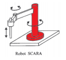
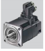

# Control_syncrhonous_motor

The project is separated in 2 parts

Part A: Modeling and symulation of the motor in open loop(without feedback) using rotoric coordinate system (Parks transformation), pole-zero analisis, transfer function analisis, feedback linearization.
Part B: Observability, Controlability, design of a Torque modulator and cascade controller (also modeling), robustnes, rlocus and pole-zero analysis, creating a desired command that can be reproduced without putting the machine in risk of braking it.

**Modeling:**

Mecanical subsystems:
 
Mecanic load (joint of a SCARA robot). We supose for simplification reasons that the inertia of the joint is constant

Synchronous Motor
The mecanic load and the motor are related by a gearbox.

Modeling each part with its differential equation and after some algebraic work we can arrive to a global mecanical model refered to the motors angle with equivalent parameters then we can write the state space as follows:

