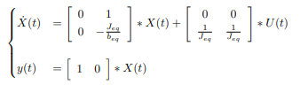

# Control_syncrhonous_motor

The project is separated in 2 parts

Part A: Modeling and symulation of the motor in open loop(without feedback) using rotoric coordinate system (Parks transformation), pole-zero analisis, transfer function analisis, feedback linearization.
Part B: Observability, Controlability, design of a Torque modulator and cascade controller (also modeling), robustnes, rlocus and pole-zero analysis, creating a desired command that can be reproduced without putting the machine in risk of braking it.

**Modeling:**

-Mecanical subsystems:

 

Mecanic load (joint of a SCARA robot). We supose for simplification reasons that the inertia of the joint is constant

Synchronous Motor

The mecanic load and the motor are related by a gearbox.

Modeling each part with its differential equation and after some algebraic work we can arrive to a global mecanical model refered to the motors angle with equivalent parameters then we can write the state space as follows:

-Electromagnetic subsystem:

Here we make use of Parks Transformation to arrive from stator variables to rotor variables and be able to express our dynamics in terms of a new coordinate system that turns along with the magnetic turning field of the motor.

The algebraic work is long and cumbersome so we will directly show the diferential equations in the new coordinate system:

Resulting in the following non linear state space:

If we were able somehow to make ids=0 then suddenly our systems whould become linear.

Notice here the similarity with a CC motor model.

if we force ids=0 in the previous equations we can arrive to an algebraic condition for that to be true: 

As vd is an imput variable and iq and w are state variables then we can anchive this condition making a feedback 

After that we model everithing on Symulink:

The plant in blue the sensors in green and the numeric implementation logic in brown.

Transfer function:

Zero-pole ubication:

We obtain this points by looking to the solutions of the characteristic polynomial in our transfer function.

Symulation:

