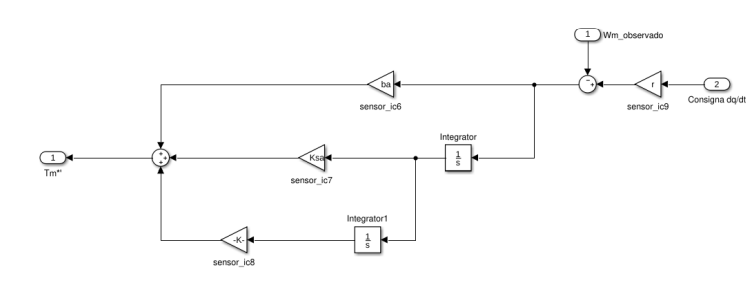

# Control_syncrhonous_motor

The project is separated in 2 parts

Part A: Modeling and symulation of the motor in open loop(without feedback) using rotoric coordinate system (Parks transformation), pole-zero analisis, transfer function analisis, feedback linearization.
Part B: Observability, Controlability, design of a Torque modulator and cascade controller, robustnes, rlocus and pole-zero analysis, observer, creating a desired command that can be reproduced without putting the machine in risk of braking it.

Part A:

**Modeling:**

-Mecanical subsystems:

 

Mecanic load (joint of a SCARA robot). We supose for simplification reasons that the inertia of the joint is constant

Synchronous Motor

The mecanic load and the motor are related by a gearbox.

Modeling each part with its differential equation and after some algebraic work we can arrive to a global mecanical model refered to the motors angle with equivalent parameters then we can write the state space as follows:

-Electromagnetic subsystem:

Here we make use of Parks Transformation to arrive from stator variables to rotor variables and be able to express our dynamics in terms of a new coordinate system that turns along with the magnetic turning field of the motor.

The algebraic work is long and cumbersome so we will directly show the diferential equations in the new coordinate system:

Resulting in the following non linear state space:

If we were able somehow to make ids=0 then suddenly our systems whould become linear.

Notice here the similarity with a CC motor model.

if we force ids=0 in the previous equations we can arrive to an algebraic condition for that to be true: 

As vd is an imput variable and iq and w are state variables then we can anchive this condition making a feedback 

After that we model everithing on Symulink:

The plant in blue the sensors in green and the numeric implementation logic in brown.

**Transfer function:**

**Zero-pole ubication:**

We obtain this points by looking to the solutions of the characteristic polynomial in our transfer function. We verify here that the system is stable.

**Symulation:**

Theta, omega, ids and iq.

Tension and current of the 3 phases. Here we can see the transient dynamic zone at the begining. But then when the system stabilizes we can see that the input of the system converges to a 3 symetrical and balanced triphaced system with fixed frequency. This frequency matches the the formula of a synchronic machine speed so we can veryfy that our model is acurate.

Part B:

**Controlability and Observability:**

We verify that the system is totaly controlable

In this case we saw that the system was obserbable from theta but not totaly obserbable from omega. Means we can use the variable theta to maybe later estimate some state variables.

**Torque Modulator:**
Here we look at the dynamics to try to uncouple the system from its physique variables.

The idea is to 'compensate' the voltage drops in the voltage command. Then we do the same for the torque, we compensate the torque drop in the torque command. We always have to scale the outputs to pass from one physical variable to another (this are the gains of the modulator).

We repeat the proces for each branch. Resulting in the folling diagram.

After implementing the torque modulator we have to define the torque comand.

**PID:**

**Zero-pole analysis:**

Here we used the desired polynomial method to define the parameters of our PID. This way we make sure the poles location is stable. 

We can see here that even if we are controling theta the imput variable of our controller is omega. So later we will build and observer to estimate it (we dont have speed sensors). We do this to avoid numeric derivation of theta. 

**Observer:**

Here the observers model has been simplyfied thanks to the toque modulator and the uncoupling of the variables. 

Notice here that an integrator has been aded to be able to eliminate the posible acumulated error in the observed theta due to posible torques perturbations on our plant.

**Final diagram:**

**Command:**

We first tryed a trapezoidal position command to make the motor turn a full turn in one direction and the controller has no problem in doing it, the probleme was the electric current was to high due to an instantanius jump in the speed (step) witch meas an infinite acceleration witch means infinite torque witch means lot of electrical current to comply what the controller is asking to do. This can terminate in burning the motors circuit. Also we had problems with the oversoot in speed and mecanical torque of the machine.

For this we tryed a trapezoidal speed command to see if softing the command would result in lower currents. Unfortunate the speed been a trapezoid means acceleration been 
a step and that means jerk been an infinite value. This jerk peaks can produce undesired intrinsic forces on the machine.

So at last we implemente trapezoidal acceleration command. The thing is we have to define it now. There are infinite trapezoidal commands that can reproduce the movement we want. 

**We are looking a way to define the orange trapezes**

So what we did was to parametrize thees trapezes and then righting down the physical restricctions (equations) in terms of the trapezes parameters :

The trapezes have 4 parameters:
Tv1: the base of the 1st trapeze
Tv2: the base of the 2nd trapeze
Tm: the dead zone between them
Alfa: the hight of both trapezes

Then we have the physical restricctions:

1) The total movement the trayectory is the double integral of the orange curve.

2)The maximum speed of the trayectory is the area under the curve of the 1st trapeze.

3)The final speed (in this case 0) is equal to the diference between the areas of the 1st and 2nd trapeze.

4)The sum of Tv1+Tv2+Tm is equal to the desired trayectory time.

Having this way a 4x4 System of Equations. Solving it we founded the trapezes parameters (Orange curve)

So if the System of Equation can find a Real Positive Solution then the command can be generated without exeeding any maximum value of the machine keeping it in sfae work conditions.

As the image shows there are no overshoots in any variable and all the maximum values of the maxhine are respected.

